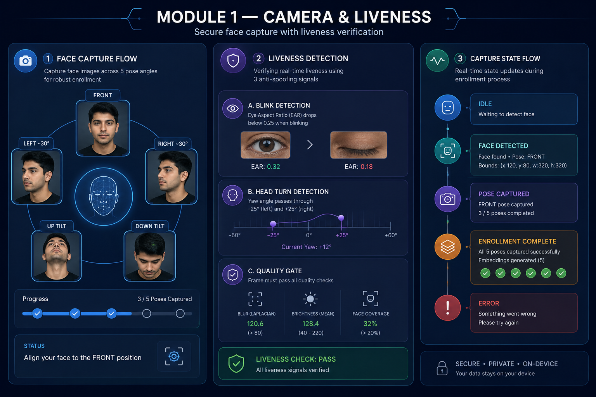
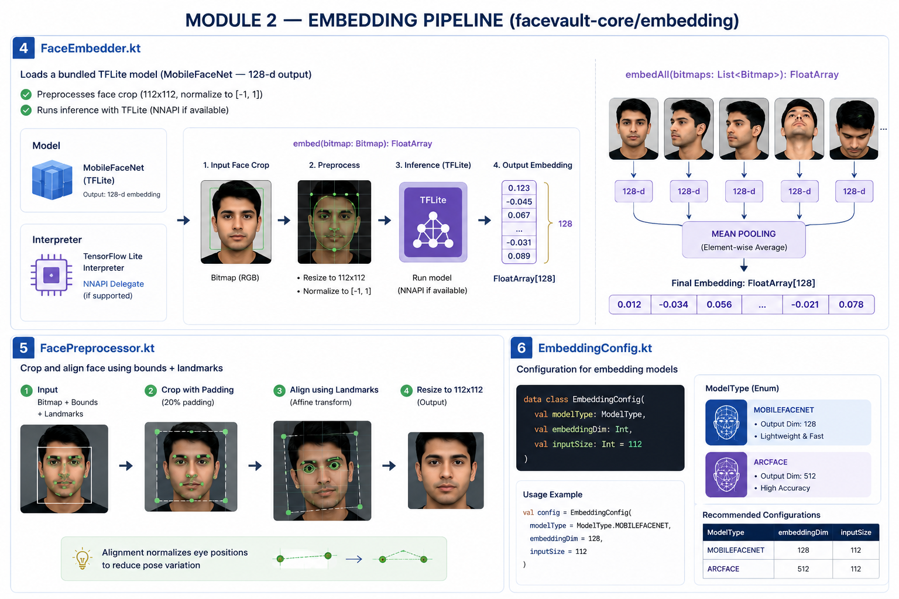
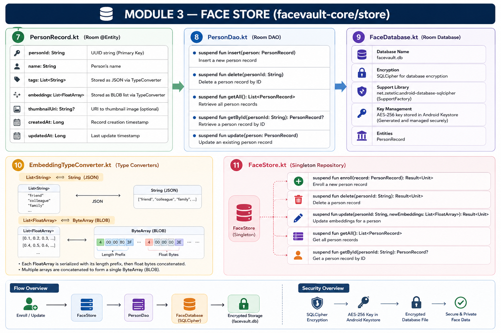
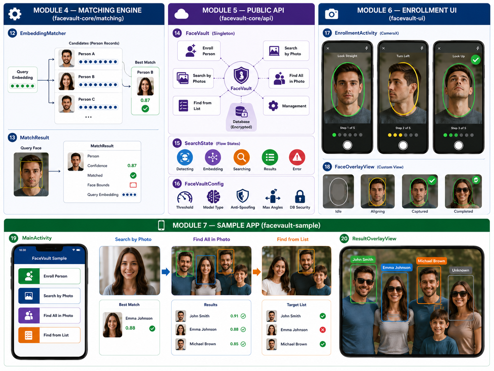

# FaceVault

On-device facial recognition for Android, packaged as a multi-module library
(AAR). Capture, liveness, embedding, encrypted storage and matching all run
**locally** — FaceVault declares **no `INTERNET` permission**.

```
facevault/
├── facevault-core/     # Pure logic (no UI): camera, liveness, embedding, store, matching, api
├── facevault-ui/       # Optional guided EnrollmentActivity + overlays
└── facevault-sample/   # Demo app exercising all four search modes
```

## Features

| Module    | What it does |
|-----------|--------------|
| `camera`    | CameraX + ML Kit capture across 5 poses (`FaceCaptureManager`) |
| `liveness`  | Blink (EAR), head-turn (yaw) and blur/brightness/coverage gates |
| `embedding` | TFLite MobileFaceNet (128-d) / ArcFace (512-d), NNAPI-accelerated |
| `store`     | Room + SQLCipher (AES-256), key sealed in the Android Keystore |
| `matching`  | Cosine-similarity engine with single / multi / targeted modes |
| `api`       | `FaceVault` singleton — `Result<T>` + `Flow<SearchState>` |

- **Min SDK 24** (Android 7.0), compileSdk 34.
- Everything off the main thread: `Dispatchers.Default` for ML, `Dispatchers.IO` for the DB.

## Architecture

### Module 1 — Camera & Liveness (`facevault-core/camera`, `liveness`)
Guided 5-pose capture, blink/head-turn/quality liveness gates, and the
`CaptureState` flow.



### Module 2 — Embedding Pipeline (`facevault-core/embedding`)
`FaceEmbedder` (TFLite + NNAPI), `FacePreprocessor` crop/align, and
`EmbeddingConfig` with mean-pooling to a final 128-d vector.



### Module 3 — Face Store (`facevault-core/store`)
`PersonRecord`/`PersonDao`/`FaceDatabase`, the `EmbeddingTypeConverter`, and the
`FaceStore` repository over SQLCipher-encrypted Room.



### Modules 4–7 — Matching, Public API, Enrollment UI & Sample
`EmbeddingMatcher`/`MatchResult`, the `FaceVault` singleton with `SearchState`,
the `EnrollmentActivity`/`FaceOverlayView`, and the demo app.



## Setup

1. **Open in Android Studio** (it provisions the Gradle wrapper automatically) or
   point `local.properties` at your SDK:
   ```properties
   sdk.dir=C\:\\Users\\you\\AppData\\Local\\Android\\Sdk
   ```

2. **Add the embedding model.** Drop a MobileFaceNet TFLite export at:
   ```
   facevault-core/src/main/assets/mobilefacenet.tflite
   ```
   It must take a `1×112×112×3` float input normalized to `[-1, 1]` and output a
   `1×128` embedding. See `assets/README_MODEL.txt`. (Everything else compiles and
   runs without it; only `FaceEmbedder` needs it at runtime.)

3. **Depend on the modules** from your app:
   ```kotlin
   dependencies {
       implementation(project(":facevault-core"))
       implementation(project(":facevault-ui")) // optional enrollment UI
   }
   ```

4. **Initialize once**, e.g. in `Application.onCreate`:
   ```kotlin
   FaceVault.init(
       context = this,
       config = FaceVaultConfig(
           matchThreshold = 0.60f,
           modelType = ModelType.MOBILEFACENET,
           enableAntiSpoofing = true,
           maxEnrollmentAngles = 5,
           dbPassphrase = null // null => auto-generated, sealed in Keystore
       )
   )
   ```

## Enrollment

### Guided, camera-based (UI module)
```kotlin
val launcher = registerForActivityResult(StartActivityForResult()) { res ->
    val personId = res.data?.getStringExtra(EnrollmentActivity.EXTRA_PERSON_ID)
}
launcher.launch(EnrollmentActivity.newIntent(context, name = "Ada Lovelace"))
```

### Programmatic, from photos
```kotlin
val result: Result<PersonRecord> = FaceVault.enrollPerson(
    name = "Ada Lovelace",
    photos = listOf(bitmap1, bitmap2, bitmap3),
    tags = listOf("family")
)
```

## The four search modes

```kotlin
// 1) Search by a single photo — one best match.
FaceVault.searchByPhoto(bitmap).collect { state ->
    when (state) {
        is SearchState.SingleResult ->
            if (state.result.matched) show("${state.result.person?.name} @ ${state.result.confidence}")
            else show("No match")
        is SearchState.Error -> show(state.message)
        else -> showProgress(state) // Detecting / Embedding / Searching
    }
}

// 2) Search by several photos of the SAME person — aggregated (mean-pooled) match.
FaceVault.searchByPhotos(listOf(bitmapA, bitmapB)).collect { state ->
    if (state is SearchState.SingleResult) render(state.result)
}

// 3) Group photo — find ALL faces and match each independently.
FaceVault.findAllInPhoto(groupBitmap).collect { state ->
    if (state is SearchState.MultipleResults) {
        state.results.forEach { r -> drawBox(r.faceBounds, r.person?.name, r.matched) }
    }
}

// 4) Group photo + target list — is each requested person present?
FaceVault.findFromList(groupBitmap, targetPersonIds = listOf(id1, id2)).collect { state ->
    if (state is SearchState.ListSearchResults) {
        state.results.forEach { (personId, match) ->
            when {
                match == null     -> log("$personId not enrolled")
                match.matched     -> log("$personId FOUND @ ${match.confidence}")
                else              -> log("$personId not in photo")
            }
        }
    }
}
```

## Management

```kotlin
val everyone: List<PersonRecord> = FaceVault.listAllPersons()
FaceVault.updatePerson(personId, newPhotos = listOf(freshBitmap))
FaceVault.deletePerson(personId)
```

## Security model

- Embeddings and metadata live in an **SQLCipher-encrypted** Room database
  (`facevault.db`, AES-256).
- The passphrase is random (256-bit), encrypted with a hardware-backed
  **AES-256-GCM** Keystore key, and stored sealed in private prefs. Plaintext only
  exists transiently in memory while opening the DB. Supply your own via
  `FaceVaultConfig.dbPassphrase` to override.
- No data ever leaves the device.

## License

See `LICENSE`.
